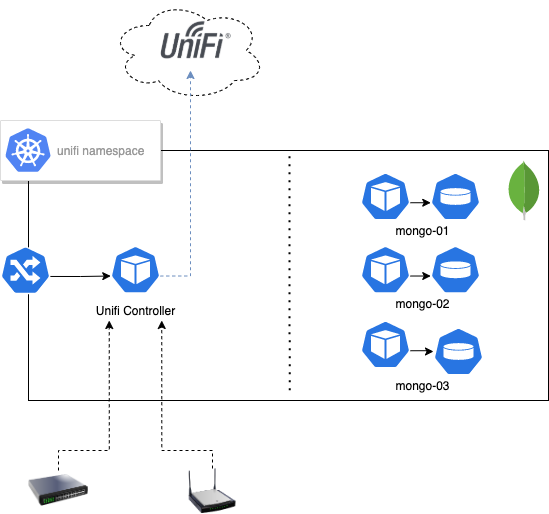

# Unifi Controller for ARM64

[ LinkedIn](https://www.linkedin.com/in/fmdlc) [ GitHub](https://github.com/fmdlc)

The **[UniFi Network Controller](https://www.ui.com/software/)** is a free software suite that allows you to set up, configure, manage, and analyze your UniFi network in a centralized manner.
Normally Unifi Controller runs in Cloud Providers or in the data center using the [Unifi Cloud Key](https://www.ui.com/unifi/unifi-cloud-key/).

This image, allows you to run Unifi Network Controller in Kubernetes using the **ARM64** architecture. It has been tested **Raspberry-Pi 4B** running Rancher's [K3s](https://k3s.io).
The main idea before building this image was to execute this with a decoupled MongoDB database, to improve availability, resiliency, and performance.

The *Ubuntu 20.10 (Focal)* based image includes the `mongodb` binaries because the Unifi Network Controller software needs it to execute the database connection, but the endpoint must be external.
Typically Unifi Controller configures two different MongoDB databases, `ace` for the configuration itself and `ace_stats` to store networking metrics.
You need to create your MongoDB cluster before using this image. A few examples of the Kubernetes configuration have been included in this repository.

## Supported tags and respective Dockerfile links

* [latest](https://github.com/fmdlc/unifi-controller/blob/master/Dockerfile), [6.0.34-beta](https://github.com/fmdlc/unifi-controller/blob/master/Dockerfile)
* [oficial](https://github.com/fmdlc/unifi-controller/blob/master/Dockerfile), [6.0.28](https://github.com/fmdlc/unifi-controller/blob/master/Dockerfile)

## Environment

The following Environment variables require to be initialized before running.

Variable | Value | Default
--- | --- | ---
|`DEBUG`| Enables init scripts debug mode |`false`|
|`JVM_MAX_HEAP_SIZE`| JVM Maximum Heap Size |`---`|
|`JVM_INIT_HEAP_SIZE`| JVM Minimum Heap Size |`---`|
|`BIND_PRIV`| Bind service privately |`false`|
|`DB_MONGO_LOCAL`| Run local MongoDB instance |`---`|
|`DB_MONGO_URI`| MongoDB URI |`---`|
|`STATDB_MONGO_URI`| StatDB Mongo URI |`---`|
|`UNIFI_DB_NAME`| Name of the UNIFI database |`---`|
|`RUN_CHOWN`| Update permissions at init |`true`|

## Running
You need to have an ARM64 cluster with a MongoDB accessible by the Unifi Controller pods. Check the `Kubernetes` directory to see examples.

## Architecture

## Exposes

The following ports are exposed by Unifi Controller.

Protocol | Port number | Description |
--- | --- | --- |
UDP	| 3478	| Port used for STUN.
TCP	| 8080	| Port used for device and controller communication.
TCP	| 8443	| Port used for controller GUI/API as seen in a web browser
TCP	| 8880	| Port used for HTTP portal redirection.
TCP	| 8843	| Port used for HTTPS portal redirection.
TCP	| 6789	| Port used for UniFi mobile speed test.
TCP | 8881  | Port used for Unifi Hotspot for redirection.
TCP | 8882  | Port used for Unifi Hotspot for redirection.
UDP	| 10001	| Port used for device discovery

> ***NOTE:*** These ports need to be open at the gateway/firewall as well as on the controller host. This would be achieved by creating port forwards on the gateway/firewall where the controller host is located.

### Egress Ports Required for UniFi Remote Access

The following ports are required to reach the Unifi Cloud for Remote Access.

Protocol | Port number | Description |
--- | --- | --- |
UDP	| 3478 | Port used for STUN.
TCP/UDP	| 443	| Port used for Remote Access service.
TCP	| 8883	| Port used for Remote Access service.

## Credits
Bootstrap scripts are based on [goofball222/unifi](https://github.com/goofball222/unifi) Docker images.

## Contributing
Pull requests are welcome. For major changes, please open an issue first to discuss what you would like to change.

## License
[Apache 2](https://www.apache.org/licenses/LICENSE-2.0)
